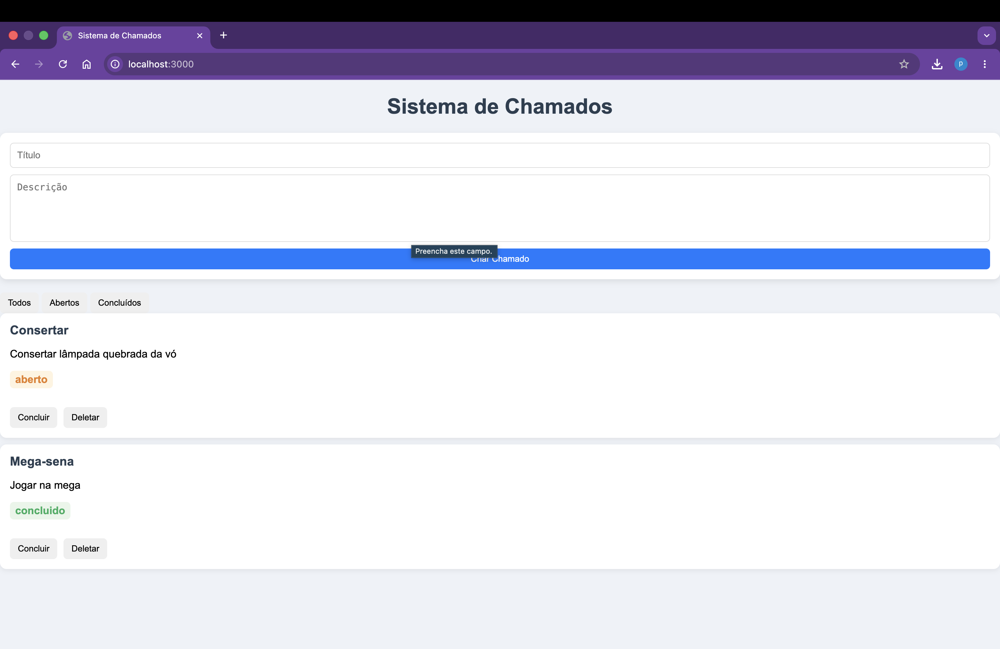
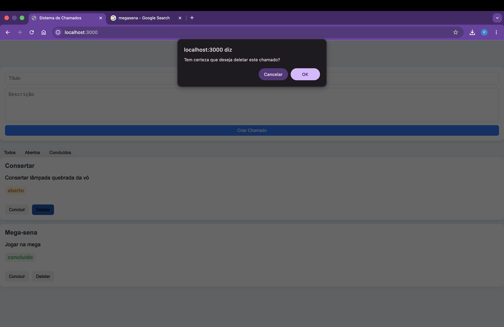

# 📋 Sistema de Chamados

Sistema simples de gerenciamento de chamados desenvolvido como projeto de estudo em desenvolvimento full stack.

A aplicação permite criar, listar, atualizar e remover chamados, com persistência de dados utilizando SQLite e interface web simples.

## 📷 Preview

### Tela inicial


### Criar chamado


### Lista de chamados


---

## 🚀 Funcionalidades

- Criar chamados
- Listar chamados em tempo real
- Atualizar status (aberto / concluído)
- Deletar chamados
- Persistência de dados com SQLite
- Interface web integrada ao backend

---

## 🛠️ Tecnologias utilizadas

### Backend
- Node.js
- Express.js
- SQLite3

### Frontend
- HTML5
- CSS3
- JavaScript (Vanilla)

---

## 📁 Estrutura do projeto
src/
├── database/
│   ├── database.js
│   └── init.js
├── routes/
│   └── chamadosRoutes.js
└── server.js

public/
├── index.html
├── script.js
└── style.css


## Como executar o projeto

**1. Clonar o repositório**
```bash
git clone https://github.com/SEU_USUARIO/sistema-chamados.git
```

**2. Entrar na pasta**
```bash
cd sistema-chamados
```

**3. Instalar dependências**
```bash
npm install
```

**4. Inicializar o banco de dados**
```bash
node src/database/init.js
```

**5. Rodar o projeto**
```bash
npm run dev
```

**6. Acessar no navegador**
```
http://localhost:3000
```